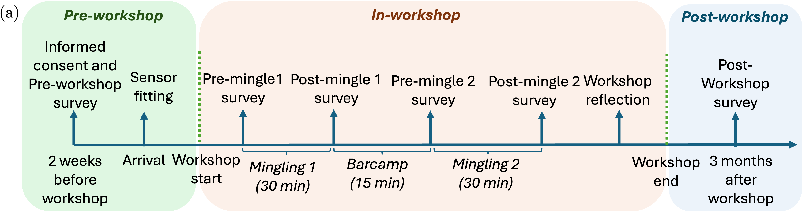

# COSILab

This repository contains data-processing utilities and model baselines for the COSILab pipeline. Each major component has its own README with operational details.

## Components

### BadgeFramework

Sensor-device utilities for Mingle/OpenBadge data.

- Decodes raw badge audio, timestamps, IMU, rotation, and scan binaries.
- Provides the hub workflow for starting/stopping badges and periodically synchronising device clocks.
- Details: [BadgeFramework/README.md](BadgeFramework/README.md)

### video_postprocess

Camera and video preprocessing utilities.

- Concatenates raw per-camera GoPro video chunks into one timecoded video per camera.
- Cuts relative or absolute-timecode video intervals.
- Generates camera calibration projects and converts solved calibration to IDIAP/EasyMocap formats.
- Details: [video_postprocess/README.md](video_postprocess/README.md)

### audio_postprocess

Code-only audio and transcript postprocessing utilities for dataset release workflows.

- Runs WhisperX-based transcription/alignment wrappers for audio clips and main-speaker audio.
- Supports Presidio/spaCy PII detection, audio redaction, and pseudonymized transcript generation.
- Includes mingling main-speaker utilities that consume externally generated diarization RTTM files, such as NeMo outputs.
- Does not include raw audio, transcripts, model weights, generated outputs, logs, caches, or cluster scripts.
- Details: [audio_postprocess/README.md](audio_postprocess/README.md)

### baselines

Model baselines and downstream feature-generation code.

- `conversation_group/SAM3`: SAM3/SAM-Body4D-based mask generation for INGroup video segments.
- `conversation_group/ViTPose`: ViTPose finetuning, SAM3-bbox-based keypoint inference, and conversion of keypoint JSON to dataframe PKL.
- `intention`: intention-recognition baseline code.
- SAM3 details: [baselines/conversation_group/SAM3/README.md](baselines/conversation_group/SAM3/README.md)
- ViTPose details: [baselines/conversation_group/ViTPose/README.md](baselines/conversation_group/ViTPose/README.md)

## Typical Flow

1. Decode and synchronise badge sensor data with `BadgeFramework`.
2. Merge/cut videos and prepare camera calibration with `video_postprocess`.
3. Run audio/transcript redaction or mingling main-speaker pseudonymization with `audio_postprocess` when preparing release-safe audio-derived text.
4. Generate masks with SAM3, run ViTPose, and convert model outputs into analysis-ready files under `baselines`.

Refer to the component READMEs for exact commands, expected folder layouts, and cluster-specific paths.

## References

- Tan, Stephanie, David M. J. Tax, and Hayley Hung. "Conversation group detection with spatio-temporal context." Proceedings of the 2022 International Conference on Multimodal Interaction. 2022.
- Carion, Nicolas, et al. "SAM 3: Segment anything with concepts." arXiv preprint arXiv:2511.16719. 2025.
- Xu, Yufei, et al. "ViTPose: Simple vision transformer baselines for human pose estimation." Advances in Neural Information Processing Systems 35. 2022: 38571-38584.
- Swofford, Mason, et al. "Improving social awareness through DANTE: Deep affinity network for clustering conversational interactants." Proceedings of the ACM on Human-Computer Interaction 4.CSCW1. 2020: 1-23.
